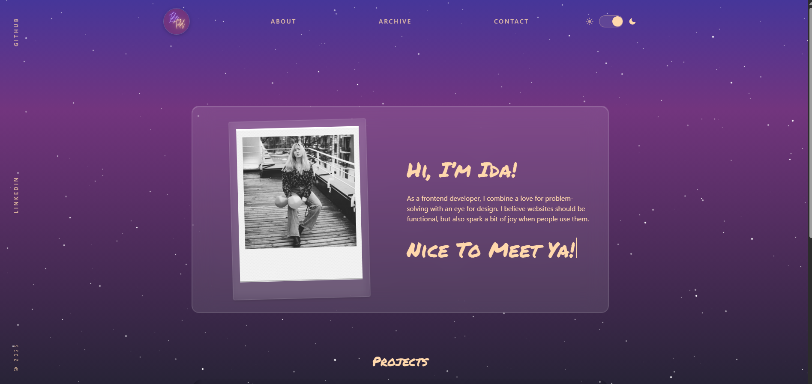

# 🌌 Portfolio 2 — Ida Toldnæs

A responsive, multi-page developer portfolio built with **React + Vite + Tailwind CSS v4**, showcasing my front-end projects, personal brand, and design philosophy.

## ✨ Features

- 🎨 **Responsive design** — fully optimized for mobile, tablet, and desktop.  
- 🌙 **Light/Dark mode** toggle with smooth transitions.  
- 🌠 **Animated starfield** background built in React for a dynamic, immersive feel.  
- 🧭 **Multi-page navigation** using React Router (Home, About, Archive, Project Detail, Contact).  
- 🪄 **Typewriter hero section** introducing my brand and personality.  
- 🧩 **Projects carousel** displaying featured work with accessible keyboard navigation.  
- 💌 **Contact form** integrated with Web3Forms API and accessibility validation.  
- 🧼 **Clean, semantic markup** and fully keyboard navigable interface.  
- 🛠️ **Built with modern stack:** React, Vite, Tailwind CSS v4, and ESLint for quality assurance.

## 🧱 Technologies Used

**Core Stack**
- ⚛️ [React](https://react.dev/) — component-based UI architecture  
- ⚡ [Vite](https://vitejs.dev/) — fast build tool and dev server  
- 💨 [Tailwind CSS v4](https://tailwindcss.com/) — utility-first styling  
- 🌐 [React Router](https://reactrouter.com/) — multi-page routing  

**Tools & Integrations**
- 🪶 [Web3Forms](https://web3forms.com/) — form submission API (Contact page)  
- 🧰 [ESLint](https://eslint.org/) — linting and code consistency  
- 🧪 [Postman](https://www.postman.com/) — API testing  
- 🖌️ [Figma](https://www.figma.com/) — UI/UX design and prototypes  
- ☁️ [Netlify](https://www.netlify.com/) — deployment and hosting  

**Design**
- ✍️ Fonts: [Permanent Marker](https://fonts.google.com/specimen/Permanent+Marker) (headings) & [Figtree](https://fonts.google.com/specimen/Figtree) (body)  
- 🌈 Custom gradient themes & reusable CSS tokens for brand consistency

## 📁 Project Structure

src/
 ├── assets/              # Images and media files
 ├── components/          # Reusable UI components (Header, Carousel, Starfield, etc.)
 ├── data/                # Static data for projects
 ├── routes/              # Page-level components (Home, About, Archive, Contact, etc.)
 ├── styles/              # Global styles and Tailwind config
 ├── App.jsx              # Root component with routing
 └── main.jsx             # React entry point

## 💐 Acknowledgements

- [Web3Forms](https://web3forms.com/) for powering the contact form  
- [React Icons](https://react-icons.github.io/react-icons/) for consistent iconography  
- Starfield background inspired by [Renee Kuai](https://codepen.io/rkuai) — adapted and rebuilt for React  
- Special thanks to **Noroff School of Technology and Digital Media** for guidance and feedback throughout the Front-End Development program ✨

## 🪪 License

All rights reserved © **Ida Toldnæs**, 2025.  
This project is part of my personal portfolio and is not open for redistribution or commercial use.  
Feel free to explore, but please do not copy, reuse, or republish code or designs without permission.
